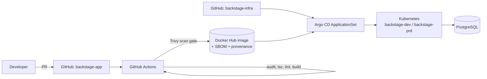

# Backstage Developer Portal

[](https://github.com/renatts/backstage-app/actions/workflows/ci.yaml)


An internal developer portal built on [Backstage](https://backstage.io). It gives engineers one place to find services, read their docs, see what runs in Kubernetes, and create new services from templates.

This repo holds the **application**: the frontend and backend code, config, and the CI pipeline that builds a scanned, signed container image. The **deployment** (Argo CD + Kustomize + Helm) lives in [backstage-infra](https://github.com/renatts/backstage-infra).

## Architecture



## What's inside

**Backend plugins** (new backend system, `packages/backend/src/index.ts`)

| Area | Plugins |
|---|---|
| Software catalog | catalog, scaffolder entity model, logs module |
| Scaffolder | scaffolder with GitHub and notifications modules |
| Docs | TechDocs |
| Kubernetes | kubernetes-backend, which shows workloads per catalog entity |
| Search | search with the Postgres engine; catalog and TechDocs collators |
| Platform | auth, permissions, notifications, signals, proxy, MCP actions |

**Configuration**

- `app-config.yaml` is for local development: in-memory SQLite and guest auth.
- `app-config.production.yaml` is for the container: PostgreSQL, with connection settings read from `POSTGRES_*` environment variables.

## CI/CD and supply chain

The pipeline (`.github/workflows/ci.yaml`) has two jobs, and **an image is only pushed if every gate passes**.

**1. Build & Audit**
- `yarn install --immutable` so dependencies match the lockfile exactly
- `yarn npm audit`, which fails on **HIGH/CRITICAL** advisories
- Type check (`tsc`) and lint
- Backend build; the output is handed to the next job as an artifact so it isn't rebuilt

**2. Scan & Push**
- Buildx image build with the GitHub Actions layer cache
- **Trivy** scan that blocks on fixable HIGH/CRITICAL CVEs; results go to the GitHub Security tab as SARIF
- Push to Docker Hub, which happens only on `main` or `v*.*.*` tags and only when registry secrets are configured, so forks and PRs never fail on a missing login
- **SBOM** and **SLSA provenance** attestations attached to the image
- Tags: `sha-<short>` on every push, `latest` on `main`, semver on tags

### Accepted vulnerabilities

Every suppression in [`.trivyignore`](.trivyignore) documents four things: the CVE, the affected path, why it can't be exploited here, and when to review it again. Suppressions are treated as tracked technical debt, not a way to silence the scanner.

## Container image

`packages/backend/Dockerfile`:
- Based on `node:24-trixie-slim` and runs as the non-root `node` user
- Installs only production dependencies (`yarn workspaces focus --production`)
- Uses BuildKit cache mounts for apt and yarn
- Built from the pre-built backend bundle, so no build toolchain is needed at runtime

## Local development

Requirements: Node.js 22 or 24, and Corepack (Yarn 4).

```sh
corepack enable
yarn install
yarn start            # frontend on :3000, backend on :7007
```

Set `GITHUB_TOKEN` to enable the GitHub integration and the scaffolder.

| Command | Purpose |
|---|---|
| `yarn tsc` | Type check |
| `yarn lint:all` | Lint all packages |
| `yarn test` | Unit tests |
| `yarn test:e2e` | Playwright end-to-end tests |
| `yarn build:backend` | Build the backend bundle |
| `yarn build-image` | Build the container image locally |

## Deployment

See [backstage-infra](https://github.com/renatts/backstage-infra). An Argo CD ApplicationSet renders the official Backstage Helm chart through Kustomize overlays for each environment, with a hardened pod security context, resource quotas and startup probes tuned for Backstage's slow cold start.

## Roadmap

- [ ] Golden-path software template: scaffold a service → create the repo → register it in the catalog → generate the Argo CD Application
- [ ] Production auth provider (GitHub OAuth) and an RBAC permission policy in place of allow-all
- [ ] TechDocs published to S3 instead of built locally
- [ ] Image signing with cosign / keyless

## Contributing

See [CONTRIBUTING.md](CONTRIBUTING.md): a protected `main`, PR-only changes, and Conventional Commits.
